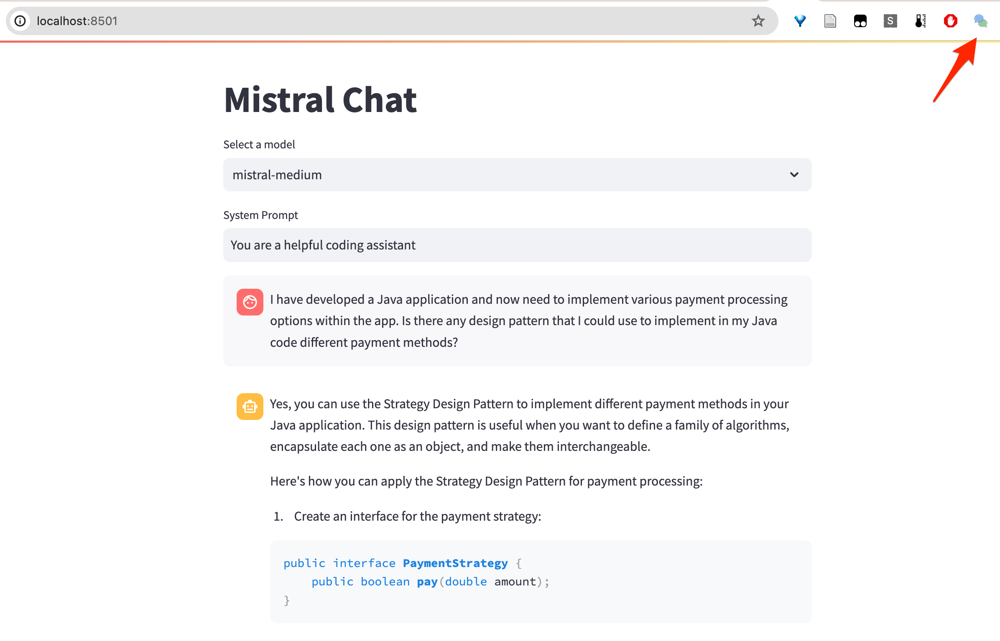

# Streamlit Convo Save

## Introduction
Streamlit Convo Save is a tool comprising a Chrome Extension and an Express backend for saving Streamlit chat conversations.

## Installation
``Note: You will need to have a running mongo database in default port 27017``


### Using the Chrome Extension in Development Mode
To use the Chrome Extension in development mode, follow these steps:

1. Open Google Chrome and go to the Extensions page by typing `chrome://extensions` in the address bar.
2. Enable the "Developer mode" toggle switch located at the top right corner of the page.
3. Click on the "Load unpacked" button and select the folder containing the Chrome Extension files.
4. Once the extension is loaded, you can test it by navigating to a Streamlit chat conversation and using the features provided by the extension.
5. Make any necessary changes to the extension's code and reload the extension to see the updated changes.

# Run Express Backend in Debug Mode

To run the Express backend (written in express-generator) with the DEBUG flag, follow these steps:
 
 1. Install the necessary dependencies by running the command:
    ```
    npm install
    ```

 2. Start the Express backend in debug mode by running the command:
    ```
    npm start
    ```
 
## Available endpoints
- (GET) / : This endpoint is used to retrieve the conversations already stored in the database

- (POST) /saveConvo : This endpoint is used to save a Streamlit chat conversation to the database.

- (GET) /test : This endpoint is used for testing purposes.

## Features




## Contributing
Guidelines for contributing to the project.

## License
Licensing information for the project.
